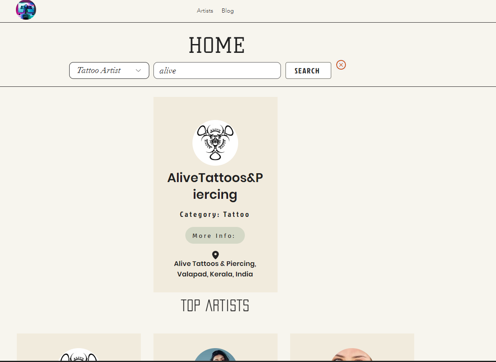
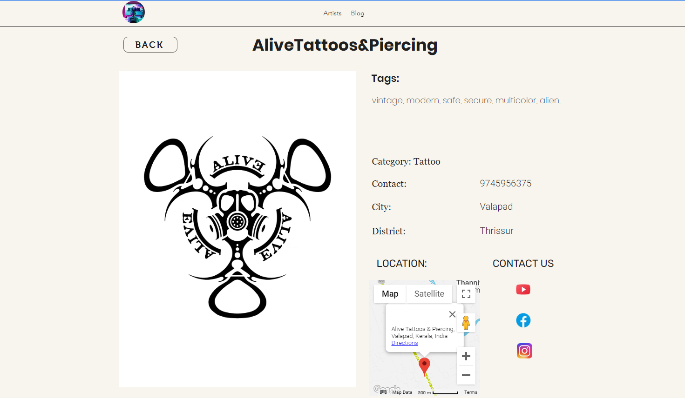
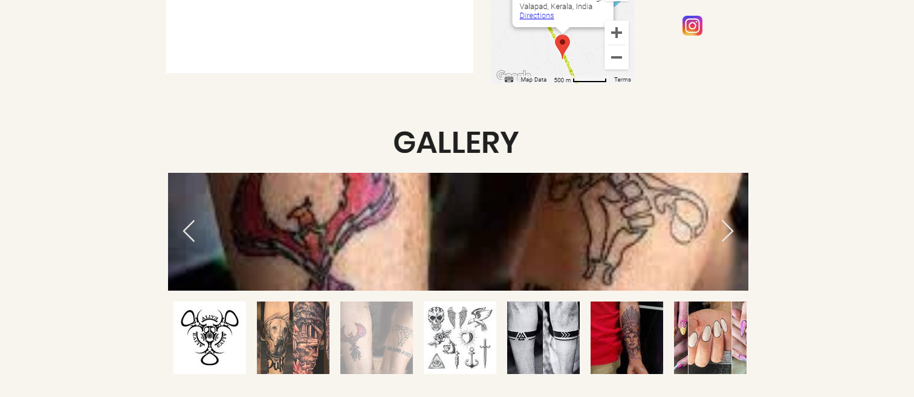
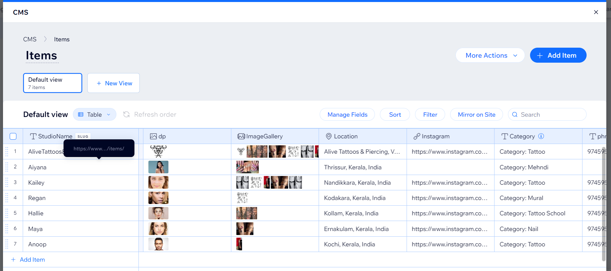
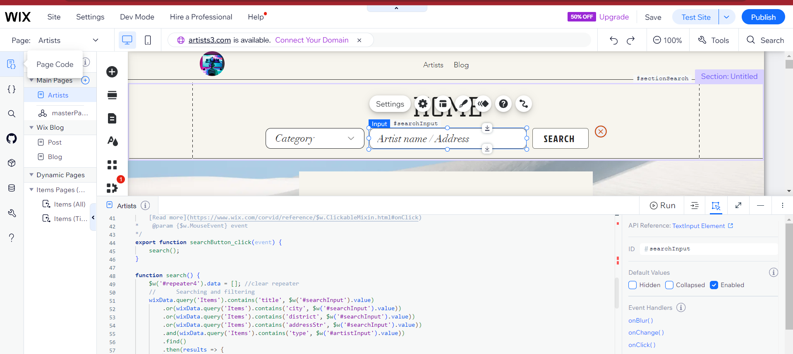

# 🎨 Artist Portfolio Platform

> A live web platform to discover, view, and manage creative artist profiles across categories like tattoo, mehndi, nails, murals and more.

---

## 🌟 Features

- 🔎 **Search & Filter**: Find artists by name, address, or category (e.g., Tattoo, Nail, etc.)
- 🏆 **Top Artists View**: Highlights top artists for quick access
- 🗺️ **Detailed Profiles**: View full artist info — phone, social media, location, recent works
- 🧠 **CMS-Based Management**: Add/edit artist profiles using structured data in a database
- 💻 **Custom Code**: Built with custom Wix code to handle filtering logic

---

## 🖼️ Screenshots

### 🔍 Search & Explore
Dropdown filter + text input to find artists.

---

### 👤 Artist Profile Page
With logo, contact, map, tags and social media.

---

### 🖌️ Artist Gallery
Scrollable image gallery for works done.

---

### 🧾 CMS Integration
Artist profiles are dynamically pulled from a CMS-style database.

---

### 🧑‍💻 Wix Custom Code
Logic for search + dynamic filtering via code editor.

---

## ⚙️ Tech Stack

| Tech          | Description                          |
|---------------|--------------------------------------|
| **Platform**  | Wix                                  |
| **Language**  | Wix Code (JavaScript variant)        |
| **CMS**       | Wix CMS Collections                  |

---

## 📅 Project Info

- **Project Type**: Live Website
- **Date**: April 2022

---

## 📌 How It Works

1. CMS stores artist data (name, image, category, socials, gallery)
2. Search bar allows users to query based on multiple fields
3. Clicking "More Info" opens a detailed profile with:
   - Tags
   - Contact
   - Instagram/Facebook/YouTube
   - Location map
4. Gallery carousel shows uploaded works
5. Admins can add/edit data in CMS without coding

---

## 🚀 Live Demo

> *(Optional: Add your live website link here if public)*  
**Example**: [Visit Live Site](https://your-wix-link.com)

---

## 🙋‍♂️ Author

Built by **Your Name**  
[Portfolio](https://aswinksanthosh.github.io/github-portfolio/) | [LinkedIn](https://www.linkedin.com/in/aswin-k-santhosh-15557a245)

---

## 🙏 Like this project?

Give it a ⭐ on GitHub or share it if you found it helpful!

